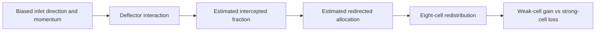
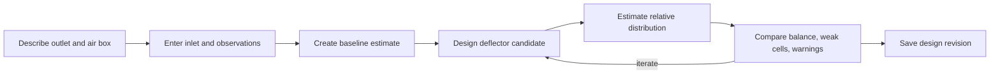
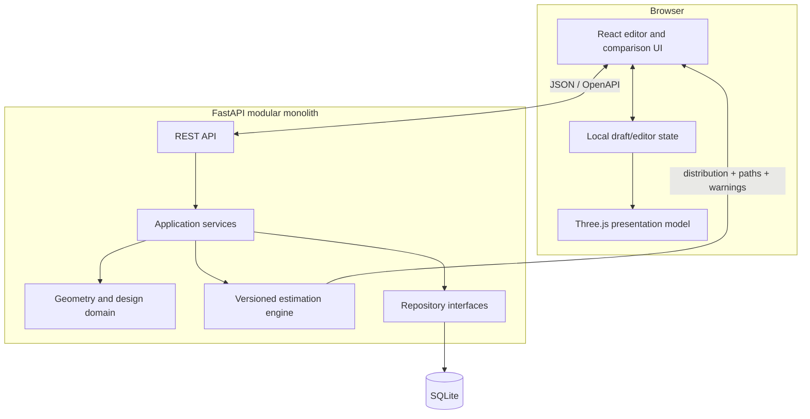
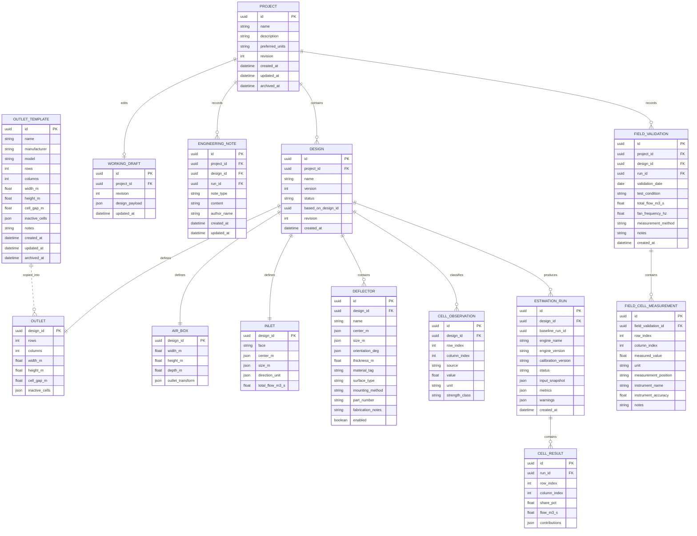

# ADD Architecture

Status: **Conditionally approved — D-01 through D-08 approved; Sprint 1 exit review pending**

## 1. Product architecture

ADD is organized around an engineer's decision loop rather than around a graphical demo:

### Primary V1 acceptance scenario

V1 is anchored to one real field problem: a 2 × 4 eight-cell outlet receives strongly directional inlet flow through a rectangular plenum, leaving approximately four usable cells and four very weak cells. An internal guide plate inside or immediately behind the grille/plenum outlet region intercepts part of the dominant flow and redirects it toward the weak cells.

The estimator and comparison workflow must represent this causal chain:



The engineering decision variables are deflector position, insertion length into the airflow path, width, and angle. A useful candidate improves the four observed weak cells while keeping reduction in the four previously strong cells within an engineer-selected acceptable bound. The estimator need not produce a physically exact velocity field, but it must react causally and comparatively to these variables.



### Product capabilities

| Capability | V1 outcome | Explicit non-goal |
|---|---|---|
| Project management | Create, rename, list, open, duplicate, archive | Collaboration, permissions, cloud sync |
| Outlet builder | Parametric rectangular grid with dimensions and cell metadata | Arbitrary CAD/BIM import |
| Air-box builder | Parametric rectangular plenum and outlet placement | Sheet-metal unfolding or structural design |
| Inlet definition | Face, position, size, direction, optional flow | Fan-system or duct-network simulation |
| Weak-area input | Select cells; optionally record measured relative/absolute readings | Automated sensor ingestion |
| Deflector designer | Configure internal guide-plate position, insertion length, width, angle, and thickness | Free-form solids and collision-resolving CAD |
| Estimation | Estimate baseline/candidate cell shares, intercepted fraction, redirected allocation, and reliability warnings | Navier–Stokes solution or code-compliance proof |
| Visualization | Geometry, directional paths, particles, cell heat map | Physically accurate streamlines |
| Comparison | Baseline/candidate cell distribution and balance metrics | Optimization guarantee |
| Persistence | Versioned project/design snapshots and runs | Multi-user merge semantics |
| Engineering knowledge | Traceable notes and field validation, kept separate from estimates | Attachment repository and automated calibration workflow |
| Outlet templates | Reserved reusable-library boundary; copy geometry into designs | Sprint 2 template-management UI unless separately approved |

### Recommended success metrics

- Interaction: geometry edits render within 100 ms on a reference laptop; estimate p95 below 1 s for documented V1 limits.
- Usefulness: in a validation set, candidate ordering agrees with measured improvement often enough to support screening; the threshold must be agreed from real data.
- Explainability: every result exposes assumptions, warnings, and dominant influences.
- Safety: the UI never labels estimated values as measured or CFD-derived.

## 2. Critical architecture challenge

The requested phrase “real-time airflow visualization” risks implying physical fidelity. A visually convincing animation can create more confidence than the estimator deserves. V1 should therefore use two coordinated but separate models:

1. **Engineering estimator:** deterministic, testable, numeric cell-distribution output.
2. **Presentation model:** visual paths and particles derived from the estimator, clearly labeled “conceptual visualization.”

The comparison panel should lead with cell-level numbers and balance metrics; animation is supporting evidence, not the result. A future CFD adapter can implement the same engine interface without changing projects or the comparison workflow.

## 3. System architecture



### Why a modular monolith

A single FastAPI process and SQLite database are appropriate for a local/single-user V1. Microservices would add deployment, consistency, and observability costs without an independent scaling need. Boundaries remain explicit so the calculation engine or database can later be separated.

### Responsibility boundaries

- React owns interaction, optimistic draft state, undo/redo, units display, and scene rendering.
- FastAPI owns validation, use-case orchestration, persistence, run creation, and OpenAPI.
- Domain layer owns geometry invariants and unit-neutral canonical values.
- Estimation engine accepts an immutable input snapshot and returns immutable results; it performs no I/O.
- Persistence maps domain data to normalized project/design records plus immutable JSON run snapshots.

### Canonical conventions

- Store all lengths in metres, angles in degrees at API boundaries and radians only internally when useful, flow in m³/s, pressure in Pa.
- Use a right-handed coordinate system: X left-to-right across outlet, Y bottom-to-top, Z from outlet into plenum. Inlet direction is a normalized vector pointing into the plenum.
- IDs are UUIDs; timestamps are UTC ISO 8601.
- Optimistic concurrency uses an integer `revision` on mutable resources.
- Delete means archive for projects/designs. Calculation runs are immutable.

### Draft, design revision, and run lifecycle

- A **working draft** is mutable editor state for one project. Debounced auto-save updates the draft and its concurrency revision only.
- A **Design revision** is a deliberate, named engineering checkpoint created from a draft. It is stable for comparison and may be cloned into a new draft. It is not created by every auto-save.
- An **EstimationRun** is immutable evidence produced from a complete input snapshot. It may reference the originating saved Design revision and records the exact draft/design revision number used.
- “Baseline” is not a global flag or permanent Design role. It is a comparison selection expressed as `baseline_run_id` on a comparison or candidate run relationship. Different comparisons may select different baselines.

## 4. Estimation engine contract

The normative pre-implementation design is `docs/validation/SOLVER_SPEC_V0.1.md`. No final estimator or polished simulation UI may be implemented until that specification and the Sprint 1.5 evidence are reviewed.

```text
estimate(input_snapshot, engine_config) -> result_snapshot
```

Inputs include geometry, inlet, engineer-classified weak cells, deflectors, units-normalized parameters, and an optional applicable calibration profile. Measured observations are validation evidence and may be supplied to benchmark tooling, but are not silently treated as estimator inputs. Outputs include relative flow per cell, normalized percentage per cell, balance metrics, optional conceptual path seeds, warnings, validation state, and traceable factor contributions.

For the primary eight-cell case, the result contract must preserve the causal accounting needed for comparison:

- Baseline and candidate `cell_share_pct` arrays aligned to all eight cells.
- `cell_delta_percentage_points` for each cell.
- Weak-cell improvement summary over the engineer-classified weak-cell set.
- Strong-cell reduction summary over its complement.
- `estimated_intercepted_fraction`, labeled as a model estimate rather than a measured mass-flow fraction.
- `estimated_redirected_allocation_pct` by outlet cell, with its normalization basis stated.
- Reliability warnings for unsupported geometry, excessive extrapolation, unstable sensitivity, invalid intersections, or calibration-envelope violations.

The model must distinguish intercepted, redirected, and unaffected relative contributions sufficiently to explain a candidate. Conservation-like bookkeeping inside the reduced-order model is required, but it must not be presented as physical mass conservation unless the model and measurements justify that claim.

Validation state uses explicit wording only: `uncalibrated`, `experimental`, `calibrated_within_supported_envelope`, or `outside_validated_envelope`. There is no generic confidence score.

A calibration profile is tied to an `engine_name` and exact compatible engine-version range, and describes a validated geometry-family envelope, parameter bounds, benchmark provenance, and version. Profiles are globally stored reference data in a local installation but are applied only through an explicit run selection and applicability check. They are never silently inherited across projects or used outside their envelope.

### V1 algorithm recommendation

Start with an explainable conservation-based reduced-order model, not hand-authored particle behavior. The earlier parcel/ray and influence-matrix spike remains useful, but neither approach is acceptable if it treats cells as independent scores or cannot expose mass, momentum, sequential extraction, and convergence residuals:

1. Generate rays/flow parcels from the inlet with deterministic sampling.
2. Propagate them through a coarse plenum representation.
3. Apply only documented and validated deflector interaction, projected-area, redirection, and loss relationships.
4. Solve coupled cell extraction against current pressure/resistance state in downstream order.
5. Deduct each extracted flow and propagate remaining mass, momentum direction, pressure, and losses.
6. Iterate the coupled state to explicit mass, pressure, cell-flow, and momentum convergence criteria.
7. Normalize to relative distribution when absolute physical inputs or validation are insufficient.
8. Report solver residuals, sensitivity, provenance, unavailable values, and out-of-domain warnings.

This is still not CFD. It is preferable to a purely heuristic “angle boosts nearby cells” formula because geometry causality is inspectable and it can drive the conceptual visualization from the same run. Before committing, build a short technical spike comparing ray/parcel and influence-matrix models against the first benchmark cases.

### Metrics

- `cell_share_pct`: normalized distribution; always available when a run succeeds.
- `cell_flow_m3_s`: only when the solver has sufficient physical boundary inputs, defensible resistance/interaction relationships, convergence, calibration provenance, and validated absolute-flow applicability. Known total inlet flow alone is insufficient.
- `coefficient_of_variation`: standard deviation / mean across active cells.
- `uniformity_index`: `min(cell_share) / mean(cell_share)`; simple but sensitive to one cell.
- `weak_cell_count`: count below a user-visible threshold relative to mean.
- `cell_delta_percentage_points`: candidate share minus baseline share for each aligned cell.
- `weak_cell_improvement`: per-cell and aggregate change for the selected weak-cell set.
- `strong_cell_reduction`: per-cell and maximum/aggregate reduction for cells previously classified as strong.
- `estimated_intercepted_fraction`: relative portion affected by the plate under model assumptions.
- `estimated_redirected_allocation_pct`: normalized allocation of the redirected portion across outlet cells.
- `pressure_loss_pa`: unavailable in relative-only mode. It may be emitted only by a solver with defensible resistance relationships, complete boundary inputs, calibration provenance, convergence, and validated limits; no pressure-loss proxy is allowed.

No single “quality score” should be introduced in V1; it would hide trade-offs and imply unsupported certainty.

## 5. Data model



Notes:

- A `DESIGN` is a named revision/candidate. Duplication creates a new design rather than overwriting a baseline.
- Mutable editor entities may be normalized for validation and queryability; immutable `input_snapshot` ensures reproducibility after later edits.
- `CELL_OBSERVATION` is limited to engineer-classified weak-area input used by the design workflow. Measured values belong only to `FIELD_CELL_MEASUREMENT`; future imported measurements must be imported there, never recast as classifications.
- SQLite JSON is acceptable for transforms/snapshots in V1, while frequently queried fields remain columns.
- `OUTLET_TEMPLATE` is an architecture-reserved, post-core-V1 concept. Sprint 2 does not implement its repository or API unless the Product Owner explicitly promotes it. When used later, a design copies template geometry and optionally records template provenance; template edits never propagate.
- Deflector geometry/calculation fields are separate from optional fabrication metadata. Material, surface, mounting, part number, and notes do not affect V1 airflow estimates.
- Engineering notes and field validations are mutable traceable knowledge records; estimation runs and cell results remain immutable. Estimated, measured, engineer-classified, and future CFD-derived values use distinct source types.
- Optional attachments are deferred. Future attachment records should link to knowledge entities without storing binary data in the core estimator contract.

## 6. API design

Base path: `/api/v1`. JSON uses snake_case. Errors follow RFC 9457 problem details. The server publishes OpenAPI, from which the TypeScript client is generated.

### Resources

| Method | Path | Purpose |
|---|---|---|
| `GET` | `/projects` | List active projects with pagination |
| `POST` | `/projects` | Create a project |
| `GET` | `/projects/{project_id}` | Read project summary |
| `PATCH` | `/projects/{project_id}` | Rename/update preferences with revision check |
| `DELETE` | `/projects/{project_id}` | Archive project |
| `GET` | `/projects/{project_id}/designs` | List design revisions/candidates |
| `POST` | `/projects/{project_id}/designs` | Create empty design or clone `based_on_design_id` |
| `GET` | `/designs/{design_id}` | Fetch complete editable design aggregate |
| `PUT` | `/designs/{design_id}` | Atomically replace validated design aggregate |
| `POST` | `/designs/{design_id}/validate` | Return geometry errors and warnings without a run |
| `POST` | `/designs/{design_id}/runs` | Create an estimate from the current or supplied snapshot |
| `GET` | `/runs/{run_id}` | Fetch immutable run, results, paths, warnings |
| `GET` | `/designs/{design_id}/runs` | List run history |
| `GET` | `/comparisons?baseline_run_id=&candidate_run_id=` | Compute aligned comparison metrics |
| `GET` | `/health/live` | Process liveness |
| `GET` | `/health/ready` | Database/migration readiness |

For V1, run creation can return `201` synchronously if the p95 target remains below one second. Preserve a `status` field and resource-oriented run endpoint so it can become `202` asynchronous later without redesigning the domain.

Draft persistence, engineering-note, field-validation, template, and calibration-profile endpoints are intentionally not frozen here. Sprint 2 should implement only approved core endpoints; adding CRUD merely because an entity is represented in the architecture would create unnecessary V1 scope.

### Representative run request

```json
{
  "design_revision": 7,
  "engine": "parcel_v1",
  "calibration_profile_id": null,
  "options": {
    "sample_count": 5000,
    "weak_threshold_ratio": 0.7
  }
}
```

### Representative run response

```json
{
  "id": "0fdfad90-5d03-49f8-9004-c5fc07c301fe",
  "status": "completed",
  "engine_version": "parcel_v1.0.0",
  "result_kind": "estimated_relative_distribution",
  "metrics": {
    "coefficient_of_variation": 0.18,
    "uniformity_index": 0.71,
    "weak_cell_count": 2,
    "estimated_intercepted_fraction": 0.31,
    "weak_cell_improvement_percentage_points": 14.6,
    "strong_cell_reduction_percentage_points": -14.6
  },
  "validation_state": "uncalibrated",
  "warnings": [
    {"code": "NO_CALIBRATION", "severity": "caution", "message": "Result is uncalibrated."}
  ],
  "cells": [
    {
      "row_index": 0,
      "column_index": 0,
      "share_pct": 13.2,
      "flow_m3_s": null,
      "delta_percentage_points": 2.1,
      "estimated_redirected_allocation_pct": 18.4
    }
  ]
}
```

## 7. UI information architecture and wireframe

The editor should use a guided workflow with persistent 3D context. Do not expose every parameter at once.

```text
┌──────────────────────────────────────────────────────────────────────────────┐
│ ADD  / Project A / Candidate 02     Saved · rev 7       [Baseline] [Run]    │
├───────────────┬───────────────────────────────────────┬──────────────────────┤
│ DESIGN STEPS  │  3D / SECTION / OUTLET VIEW          │ PROPERTIES           │
│ 1 Outlet   ✓  │                                       │ Selected: Deflector 1│
│ 2 Air box  ✓  │       inlet →  conceptual paths      │ Position X  [  ] m   │
│ 3 Inlet    ✓  │             ╲                         │ Position Y  [  ] m   │
│ 4 Weak area   │          ┌────╲──── plenum ─────┐     │ Width       [  ] m   │
│ 5 Deflectors  │          │     ╱ plate          │     │ Angle       [  ] °   │
│ 6 Compare     │          └──┬──┬──┬──┬──────────┘     │ [Duplicate] [Remove] │
│               │             outlet cells              │                      │
│ Warnings (1)  │ [Orbit] [Section] [Heat map] [Paths] │ Validation messages  │
├───────────────┴───────────────────────────────────────┴──────────────────────┤
│ Estimated relative distribution · Uncalibrated · Not CFD                   │
└──────────────────────────────────────────────────────────────────────────────┘
```

Comparison mode:

```text
┌───────────────────────────────┬──────────────────────────────────────────────┐
│ BASELINE                      │ CANDIDATE 02                                 │
│ outlet heat map / cell labels │ outlet heat map / cell labels               │
│ CV 0.41 · weak cells 4        │ CV 0.18 · weak cells 2                      │
├───────────────────────────────┴──────────────────────────────────────────────┤
│ Cell   Baseline share   Candidate share   Change      Observation source    │
│ R1C1       18.0%             13.2%          -4.8 pp   estimated             │
│ ...                                                                          │
│ Assumptions and warnings [expanded by default for uncalibrated runs]         │
│ Weak cells: gain summary · Strong cells: reduction summary                   │
│ Intercepted: estimated fraction · Redirected: allocation by eight cells      │
└──────────────────────────────────────────────────────────────────────────────┘
```

### Interaction rules

- Direct manipulation and numeric fields stay synchronized; numeric entry is authoritative for fabrication precision.
- Invalid geometry remains editable but cannot be run; collision and bounds errors are shown both in-scene and beside fields.
- Weak-cell selection is a separate outlet-grid mode, not a 3D picking trick.
- Auto-save drafts after a short debounce; “Run” creates an immutable snapshot.
- Undo/redo applies to local design edits, not project deletion or completed runs.
- Every visualization provides a table/grid alternative and does not rely on color alone.
- The primary comparison view always renders all eight 2 × 4 cells in a stable physical order and distinguishes observed weak and previously strong groups.
- Deflector controls use field terms: position, insertion length, width, and angle. Generic 3D scale/rotation controls may support editing but must not replace these engineering inputs.

## 8. Quality attributes

| Attribute | V1 decision |
|---|---|
| Performance | 60 fps scene target during ordinary interaction; degrade particle count adaptively, never calculation quality |
| Reproducibility | Same snapshot + engine/calibration version yields same result |
| Validation | Schema, domain invariant, geometry collision, and engine-domain validation are distinct |
| Observability | Structured logs with request/run IDs; timing and warning counts; no sensitive geometry dumping by default |
| Security | Local-first, bind server to loopback by default, strict CORS, validate payload sizes; no auth until deployment requires it |
| Accessibility | Keyboard-operable forms and cell grid, non-color result labels, reduced-motion setting |
| Portability | Browser UI with API boundary; SQLite path configurable; export/import planned after core workflow |

## 9. Testing and validation strategy

- Domain unit tests: dimensions, coordinate transforms, cell indexing, collisions, unit conversion.
- Engine golden tests: fixed snapshots produce stable distributions within stated tolerances.
- Property tests: shares are non-negative, normalized, deterministic, symmetric for symmetric inputs.
- API contract tests: validation/problem responses, concurrency conflict, immutable runs.
- UI tests: editor state transitions, accessibility, warning visibility, before/after alignment.
- End-to-end tests: create project → design → run → compare → reopen.
- Engineering validation: benchmark against measured outlet-cell flows for representative inlet/box/deflector configurations.
- Primary acceptance benchmark: a biased-inlet 2 × 4 case with approximately four strong and four weak cells, followed by at least one deflector candidate. Verify per-cell deltas, weak-cell gain, strong-cell loss, intercepted estimate, redirected allocation, warnings, and measured candidate ordering.
- Causal sensitivity tests: increasing insertion or changing angle across valid small increments must produce explainable, deterministic changes; discontinuities and counter-intuitive reversals require documented warnings or model rejection.

The engine must not graduate from “experimental” until a validation report states its supported envelope, sample size, errors, and failure cases. Matching a handful of intuitive examples is insufficient.

## 10. Decisions requiring review

| ID | Decision | Recommendation | Consequence if deferred |
|---|---|---|---|
| D-01 | Deployment model | Local single-user web app for V1 | Auth and database choices remain ambiguous |
| D-02 | Geometry envelope | Rectangular box/outlet; planar rectangular deflectors | Algorithm and editor scope expands sharply |
| D-03 | Result semantics | Relative by default; absolute only with sufficient physical inputs and a validated converged model | Risk of false precision |
| D-04 | Engine approach | Time-box parcel vs influence-model spike, then choose by validation | UI may hard-code an unsuitable model |
| D-05 | Calibration | Acquire a small measured benchmark before engine completion | No defensible usefulness criterion |
| D-06 | Project revisions | Immutable runs and cloneable design revisions | Comparison/audit history becomes unreliable |
| D-07 | Units | SI canonical storage; SI/IP display | Conversion defects and inconsistent persistence |
| D-08 | Engineering knowledge and field validation | Separate traceable notes, validations, and measurements linked to projects/designs/runs | Measurements may be confused with or overwrite estimates |

All D-01 through D-08 are approved by the conditional Sprint 1 review. Detailed rationale is recorded in `docs/adr/`.

## 11. Local deployment and data safety

- Bind the API to `127.0.0.1` by default; external binding requires an explicit future deployment decision.
- Do not add cosmetic authentication to a loopback-only single-user product. If remote access is introduced, threat modeling and authentication become mandatory.
- The runtime data directory must be configurable and visibly documented before Sprint 2 closes. The proposed default is an OS-appropriate per-user application-data directory, not the installation directory.
- Backup is a consistent copy of the SQLite database taken through an application-controlled backup operation or while the application is stopped. Restore validates schema/application compatibility and preserves the replaced database as a recoverable backup.
- Exact platform paths, retention, and UI commands remain Product Owner/deployment decisions.

## 12. Future evolution

The `EstimationEngine` interface should later support calibrated reduced-order versions and a CFD job adapter. PostgreSQL, object storage, authentication, and background workers are deployment evolutions, not V1 defaults. CAD/BIM exchange and automated optimization should follow validated engine behavior; optimizing an unvalidated proxy merely finds better ways to exploit its errors.
