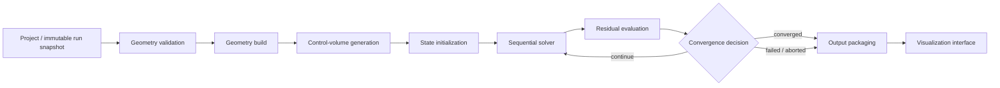
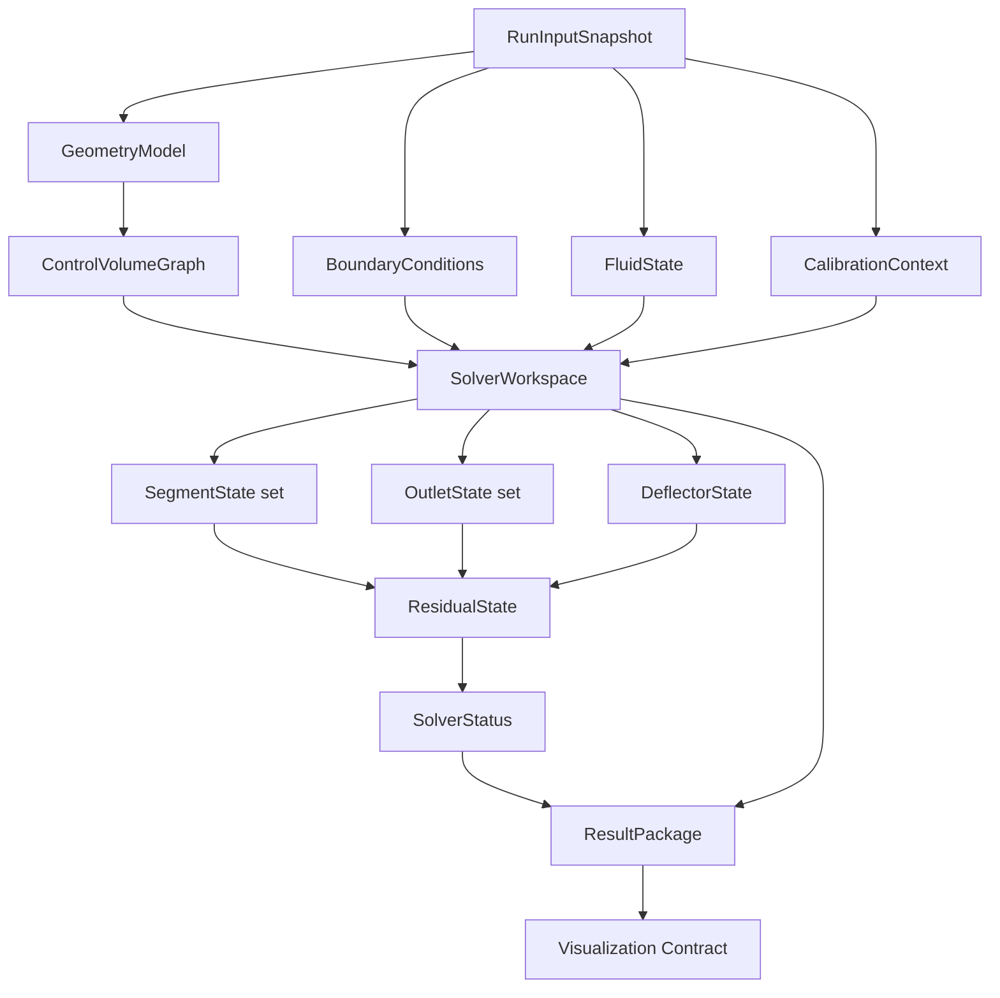
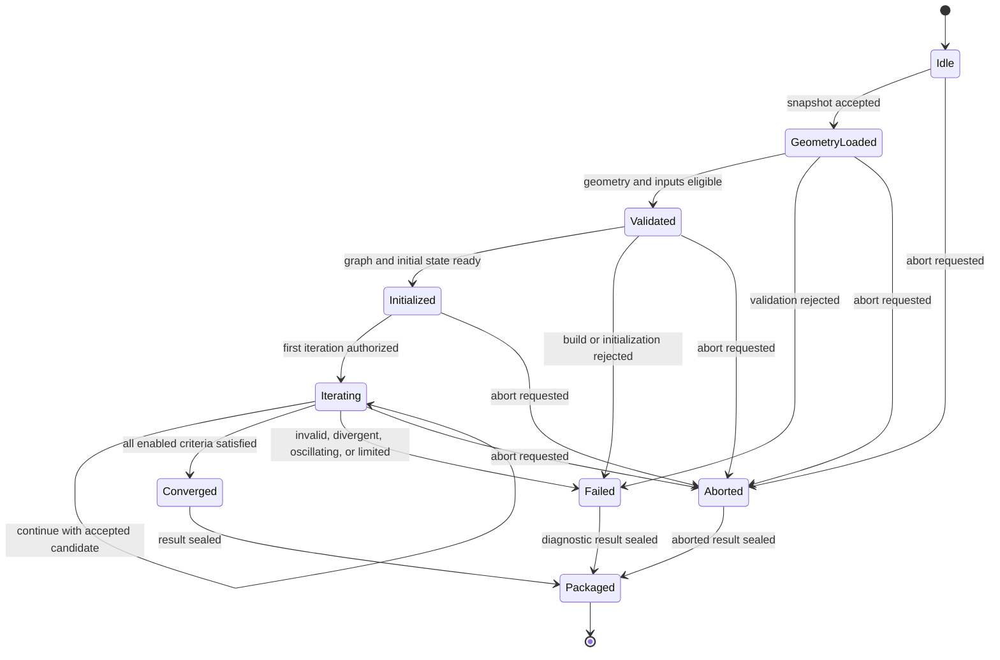
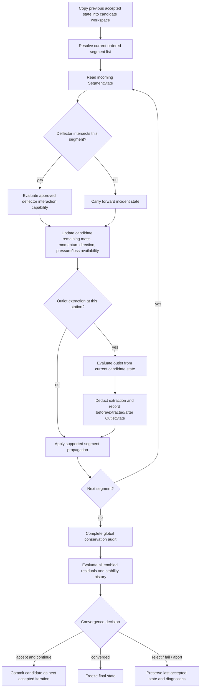

# ADD V0.1 Solver Execution Architecture

Status: Canonical Sprint 1.5 implementation reference — architecture only

## Document authority and boundaries

This document defines how the ADD reduced-order solver executes. It bridges the approved HVAC physics baseline and future Sprint 1.5 implementation without redefining physical equations.

Normative references:

- `HVAC_DOMAIN_REVIEW_PACKAGE.md` is the approved authority for reviewed physical relationships, classifications, required inputs, calibration dependencies, and unsupported claims. It must not be overridden here.
- `SOLVER_SPEC_V0.1.md` defines the pre-implementation solver contract and output intent.
- This document is authoritative for execution stages, internal data ownership, state transitions, solve order, stability controls, error behavior, result packaging, and extension interfaces.

If these documents conflict, execution must stop for architecture review. Implementation must not silently choose an interpretation.

This document contains no implementation code, numerical constants, guessed coefficients, or new physical equations.

## Architectural invariants

- The solver is headless and independent of UI, Three.js, HTTP, and persistence technologies.
- The immutable input snapshot is the sole engineering input to a run.
- The deflector is the primary simulated engineering object.
- Outlet extraction is coupled and sequential; no cell is calculated from an unchanged inlet state.
- Every engineering result is generated, classified, and packaged by the solver.
- The UI may select and format solver-provided fields but may not derive heat maps, airflow values, gains, losses, rankings, recommendations, or confidence.
- Missing inputs and unsupported relationships produce explicit unavailable values or failure—not guessed defaults.
- Non-converged, aborted, failed, or outside-envelope results cannot produce engineering recommendations.
- Every run preserves solver version, configuration, calibration provenance, assumptions, residuals, warnings, and claim level.

## 1. Solver lifecycle

### Stage contract

| Stage | Purpose | Required inputs | Produced outputs | Failure conditions |
|---|---|---|---|---|
| Project snapshot intake | Freeze one reproducible run request | Design snapshot, solver request, solver/calibration identifiers, requested claim level | Immutable `RunInputSnapshot`; input fingerprint; provenance header | Missing snapshot identity, unsupported schema version, mutable/unresolved reference, unavailable solver version |
| Geometry validation | Reject impossible, ambiguous, or unsupported geometry before calculation | Canonical geometry request, coordinate convention, V0.1 applicability envelope | `GeometryValidationReport`; eligibility flags; normalized unit declarations | Missing/negative dimensions, invalid transforms, overlapping solids where prohibited, outlet outside plenum, invalid normals, unsupported count/topology, ambiguous downstream domain |
| Geometry build | Resolve validated parametric inputs into solver-owned geometry | Validated geometry; inlet/outlet/deflector definitions | Immutable `GeometryModel`; derived geometric attributes; geometry provenance | Non-finite derived geometry, zero effective areas, invalid deflector placement, unstable/ambiguous intersection construction |
| Control-volume generation | Convert geometry into an auditable flow-domain representation | `GeometryModel`; approved topology policy | Immutable `ControlVolumeGraph`; segment/outlet/deflector nodes; connectivity; provisional extraction order | Disconnected graph, missing inlet/outlet path, cyclic topology unsupported by selected solver, ambiguous residual path, ordering cannot be determined within V0.1 |
| State initialization | Establish boundary, fluid, and initial iterative states without invented values | Graph, boundary conditions, fluid state, calibration applicability, solver configuration | Immutable `InitialState`; mutable solver workspace; enabled-equation/residual set; claim eligibility | Mandatory input missing, incompatible units, invalid fluid state, calibration mismatch, absolute mode requested without sufficient validated inputs, no permitted initialization strategy |
| Sequential solver | Propagate interaction and extraction through the ordered graph for one iteration | Current workspace, graph, approved model capabilities, configuration | Candidate next segment/outlet/deflector states; iteration trace; constraint events | Invalid intermediate state, unsupported flow reversal/topology, required relationship unavailable, non-finite operation, conservation cannot be enforced |
| Residual evaluation | Compare candidate and previous states and audit conservation | Previous/candidate state, enabled residual definitions, configured criteria | `ResidualState`; conservation audit; trend history | Residual cannot be evaluated, normalization reference invalid, non-finite residual, bookkeeping mismatch |
| Convergence decision | Decide continue, converge, fail, diverge, oscillate, or abort | Residual state/history, constraint/order stability, iteration policy, abort signal | Updated `SolverStatus`; accepted state or next-iteration state | Iteration limit, divergence/oscillation policy triggered, constraints never stabilize, external abort, residual requirement unavailable |
| Output packaging | Produce one immutable, self-describing result even for failure | Final/last valid state, status, residuals, inputs/provenance, warnings, claim policy | `ResultPackage`; engineering values or explicit unavailable fields; diagnostics | Packaging schema violation, provenance incomplete, value lacks source/claim metadata, invalid result attempts to expose recommendation |
| Visualization interface | Provide read-only solver results to UI/animation adapters | Immutable result package; selected view request | Presentation DTO containing only solver-provided engineering values and non-engineering display metadata | UI requests an unexported derived engineering quantity, result compatibility mismatch, forbidden field for current claim/status |

### Lifecycle completion rule

A run is complete when an immutable `ResultPackage` exists with terminal solver status. Completion does not imply convergence, validation, or engineering usability. Those are explicit fields.

## 2. Internal data flow

### Data-object catalog

| Object | Owner | Lifetime | Mutability | Dependencies and responsibility |
|---|---|---|---|---|
| `RunInputSnapshot` | Run orchestrator | Entire run and persisted history | Immutable | User-approved design snapshot, solver request, source units, versions, requested mode; no live project references |
| `GeometryValidationReport` | Geometry validator | Validation through packaging | Immutable after validation | Input snapshot and supported envelope; contains errors, warnings, eligibility, no solver values |
| `GeometryModel` | Geometry builder | Entire run | Immutable | Validated canonical geometry; owns derived positions, normals, areas, projected geometry descriptors, and derivation provenance |
| `ControlVolumeGraph` | Control-volume generator | Entire run | Immutable | Geometry model and topology policy; owns nodes, edges, extraction locations, flow adjacency, and initial order |
| `BoundaryConditions` | State initializer | Entire run | Immutable | Input snapshot and claim mode; distinguishes measured, specified, derived-by-approved-source, and unavailable boundaries |
| `FluidState` | State initializer | Entire run | Immutable | Approved physical inputs/derivations and provenance; unavailable properties remain unavailable |
| `CalibrationContext` | Calibration resolver | Entire run | Immutable | Solver version, selected profile, applicability envelope, coefficient provenance, compatibility decision; never silently selected |
| `SolverConfiguration` | Run orchestrator | Entire run | Immutable | Enabled capabilities, residual definitions, convergence policy, stability policy, trace policy; versioned and included in provenance |
| `InitialState` | State initializer | Initialization and audit history | Immutable | Graph, boundaries, fluid state, calibration, initialization method; basis for first workspace state |
| `SolverWorkspace` | Sequential solver | Iteration loop | Mutable, solver-private | Holds current/previous candidate states and histories; cannot escape as an engineering result |
| `SegmentState` | Sequential solver | One accepted iteration plus trace history as configured | Candidate mutable then immutable when accepted | Incoming/remaining state, representative pressure availability, momentum direction, accumulated losses, state provenance |
| `DeflectorState` | Deflector interaction component | One iteration plus accepted trace | Candidate mutable then immutable when accepted | Incident segment, geometry, interaction model capability, calibration context; contains intercepted/redirected/residual availability and audit fields |
| `OutletState` | Outlet extraction component | One iteration plus accepted trace | Candidate mutable then immutable when accepted | Incoming segment state, outlet geometry/resistance availability, extraction order; records before/extracted/after state |
| `ResidualState` | Residual evaluator | Current iteration and retained trend window | Immutable per evaluation | Previous/candidate states and enabled criteria; contains each residual, availability, trend, and constraint/order stability |
| `SolverStatus` | State machine/orchestrator | Entire run; updated by transitions | Mutable only through defined transitions | Current state, terminal reason, iteration metadata, abort request, recoverability, recommendation eligibility |
| `DiagnosticEvent` | Component that detects event; collected by orchestrator | Entire run and result history | Append-only | Stable code, severity, stage, object reference, user-safe message, engineering detail, cause, action |
| `ResultPackage` | Result packager | Persisted run lifetime | Immutable | Input fingerprint, final status/state, residual report, provenance, applicability, values/unavailable reasons, warnings |
| `VisualizationContract` | Output adapter | UI session/request | Immutable view of result | Result package only; may reshape/format display metadata but cannot create engineering quantities |

### Ownership rules

- Builders create immutable domain objects and cannot mutate the input snapshot.
- Only the solver workspace is mutable during iteration.
- Candidate states become accepted only after stability, validity, and conservation checks for that iteration.
- Persistence stores input and result packages, not a live mutable workspace.
- Visualization receives no solver configuration knobs capable of changing engineering outputs after a run.

## 3. Solver state machine

### State definitions

| State | Entry conditions | Permitted work and exit conditions | Failure conditions |
|---|---|---|---|
| `Idle` | Solver instance available; no active run | Accept exactly one immutable snapshot; exit to `GeometryLoaded`, or `Aborted` if cancelled | Invalid orchestrator lifecycle is an internal unrecoverable error |
| `GeometryLoaded` | Snapshot schema/version accepted and fingerprinted | Validate geometry, claim request, inputs, and compatibility; exit to `Validated` only with no blocking errors | Blocking validation error exits to `Failed`; abort exits to `Aborted` |
| `Validated` | Geometry and minimum requested-mode inputs eligible | Build geometry/graph and initialize solver-owned state; exit to `Initialized` when complete | Build/topology/initialization failure exits to `Failed`; abort exits to `Aborted` |
| `Initialized` | Immutable graph, boundaries, configuration, and initial state exist | Perform pre-iteration audit; exit to `Iterating` when enabled residuals can be evaluated and execution is authorized | Invalid initial conservation/state, unavailable required relationship, or abort |
| `Iterating` | Previous accepted state and iteration policy exist | Execute one sequential pass, evaluate residuals, and accept/reject candidate; remain if continuation is safe, exit to `Converged` when all criteria pass | Invalid/non-finite state, conservation failure, divergence, oscillation, iteration limit, unsupported topology change, external abort |
| `Converged` | Every enabled residual passes and active constraints/order are stable | Freeze final state and package; only exit to `Packaged` | Packaging/provenance failure is internal and terminal; convergence cannot be revoked silently |
| `Failed` | A terminal validation/numerical/internal condition exists | Preserve last valid state and diagnostics; package no forbidden claims | Failure without stable diagnostic code/provenance is a packaging failure |
| `Aborted` | Valid abort request acknowledged at a safe checkpoint | Preserve last accepted state and abort reason; package as non-engineering terminal result | Forced termination without a consistent snapshot may permit diagnostics only |
| `Packaged` | Immutable result schema validated and sealed | Return/persist exactly one result; no further transitions or mutations | Any post-package mutation is prohibited |

### Transition governance

- Only the orchestrator may transition solver state.
- Components report events and candidate outcomes; they do not set terminal state directly.
- Abort is checked between stages, between sequential elements, and before accepting an iteration candidate.
- A failed or aborted run is not resumed. A new run may start from the same immutable input with a new run identity and explicit configuration.

## 4. Sequential solve order

One iteration is an atomic candidate pass. Partial candidate values are never exposed to the UI or stored as completed engineering results.

### Iteration architecture requirements

1. Start from the previous accepted iteration, never a partially failed candidate.
2. Resolve the extraction order using the approved ordering policy and current accepted bulk-flow state.
3. Process segments serially along the current control-volume graph.
4. Evaluate the deflector once at its graph location using the current incident segment state.
5. Carry its solver-produced intercepted, redirected, residual, direction, pressure/loss availability, and warning state downstream.
6. At each outlet, evaluate extraction against the current local candidate state—not inlet totals.
7. Deduct accepted extraction before creating the state presented to the next segment/outlet.
8. Prevent any outlet from extracting an amount incompatible with the available remaining basis; treat the event through stability/error policy rather than silently clamping an engineering result.
9. Preserve an auditable before/extracted/after record for every outlet.
10. Complete a global conservation audit only after the sequential pass finishes.
11. Evaluate all enabled residuals together; one passing residual cannot override another failure.
12. Accept the candidate iteration only if it is finite, internally valid, conservation-audited, and allowed by the stability policy.

When the current model cannot represent multiple competing paths, recirculation, or flow-order reversal, it exits or downgrades through applicability/error handling. It must not manufacture a convenient linear order.

## 5. Numerical stability strategy

No numerical constants are authorized here. All thresholds and policies are versioned configuration requiring later numerical and domain review.

| Concern | Architecture requirement | Prohibited behavior |
|---|---|---|
| Under-relaxation | Apply only to explicitly identified iterative state variables through a versioned policy; retain raw and relaxed candidate values in diagnostics; verify relaxation does not hide conservation failure | Hard-coded factor, UI-controlled factor, or reporting a relaxed intermediate as converged without residual checks |
| Negative-flow prevention | Validate sign conventions; distinguish supported reverse flow from impossible negative extraction; reject or mark outside-envelope if reverse flow is unsupported | Taking absolute value, silently setting to zero, or redistributing the deficit without provenance |
| Invalid geometry | Detect before initialization and recheck derived areas/intersections after build; return stable error codes tied to objects | Repairing dimensions, moving plates, or guessing normals automatically |
| NaN/infinity protection | Check all imported, derived, candidate, relaxed, residual, and packaged engineering values at component boundaries; stop candidate acceptance on first non-finite value | Serializing non-finite values, replacing them with zero, or continuing iteration |
| Mass conservation | Maintain station-level before/extracted/after bookkeeping and global audit; candidate acceptance requires the configured conservation policy | Renormalizing final cell shares to conceal a physical bookkeeping defect; relative presentation normalization must remain distinct and traceable |
| Iteration limit | Version a maximum-iteration policy and report limit termination with last accepted residuals | Treating the last iteration as converged or usable merely because the limit was reached |
| Oscillation detection | Track residual and selected-state history; detect alternating or repeating patterns under a versioned policy; preserve evidence | Endless iteration, arbitrary averaging, or accepting an oscillatory result |
| Divergence detection | Track worsening residual/state magnitude and invalid constraint growth; terminate or apply an approved recovery step | Repeatedly relaxing until a plausible-looking result appears |
| Constraint stability | Require active constraints and extraction order to remain stable according to the convergence policy | Declaring convergence while ordering or bounded states still switch |
| Recovery attempt | Permit only named, versioned strategies with a bounded attempt policy and diagnostic trail | Hidden retries with different coefficients, equations, or inputs |

The solver separates three operations:

- **Physical/model constraints:** arise from the approved model and inputs.
- **Numerical stabilization:** changes the path to a solution, not the governing model or reported provenance.
- **Presentation normalization:** produces solver-owned relative shares after a valid solution; it cannot repair conservation or convergence.

## 6. Error handling

### Severity model

- `info`: provenance or mode statement; no degradation.
- `warning`: result remains available but has a stated limitation; recommendation eligibility follows claim policy.
- `blocking_input`: user/project input must be corrected before solving the requested mode.
- `numerical_failure`: initialization/iteration cannot produce an accepted converged result.
- `outside_envelope`: calculation mode/model is not validated for the input; relative fallback is allowed only when explicitly supported and rerun as that mode.
- `internal_failure`: invariant, schema, or packaging defect; no engineering result may be presented.
- `aborted`: user/system cancellation; no completed engineering result.

### Error catalog

| Error | Cause | Severity | User message | Solver action |
|---|---|---|---|---|
| Missing geometry | Required plenum, inlet, outlet, cell, or deflector geometry absent | `blocking_input` | “Required geometry is incomplete. Add the identified component before running.” | Stop during validation; list missing object/field; no initialization |
| Negative or zero area | Supplied or derived effective area is not physically usable | `blocking_input` or `internal_failure` when derived from valid inputs | “A required flow area is zero or negative. Review the identified geometry.” | Reject geometry; preserve object path and derivation provenance |
| Invalid outlet | Outlet lies outside domain, has invalid normal/area, duplicates another cell, or violates topology | `blocking_input` | “Outlet cell geometry is invalid for the selected solver envelope.” | Stop before graph generation; enumerate affected cells |
| Invalid deflector | Plate placement/orientation/intersection is impossible or outside envelope | `blocking_input` | “Deflector geometry cannot be evaluated in this solver configuration.” | Reject run; do not auto-correct placement |
| Missing boundary condition | Requested absolute/pressure mode lacks required boundary data | `blocking_input` | “Absolute airflow/pressure cannot be solved because required boundary inputs are missing. Relative mode may be available.” | Reject requested mode; return missing-input list; never silently downgrade within the run |
| Missing relationship/coefficient | Required resistance, interaction, or loss relationship lacks approved provenance | `blocking_input` | “The selected calculation requires reviewed engineering data that is not available.” | Mark affected values unavailable; reject mode if required for solve |
| Calibration incompatible | Profile solver version or applicability envelope does not match | `outside_envelope` | “The selected calibration is not valid for this geometry or operating condition.” | Do not apply profile; reject calibrated/absolute claim; require explicit new run selection |
| Control-volume graph invalid | No valid path, unsupported cycle/branch, or ambiguous residual exit | `outside_envelope` or `blocking_input` | “This flow topology is not supported by ADD V0.1.” | Stop before initialization; package topology diagnostics |
| Negative extraction candidate | Candidate predicts unsupported direction or exceeds remaining basis | `numerical_failure` or `outside_envelope` | “The solver produced an unsupported outlet-flow state and did not accept the iteration.” | Reject candidate; apply only approved recovery; otherwise fail |
| Non-finite value | Any engineering input, state, residual, or output is NaN/infinite | `internal_failure` for derived values; `blocking_input` for supplied values | “The run stopped because an invalid numerical value was detected.” | Stop at boundary; preserve component and field; expose no affected engineering result |
| Mass audit failure | Candidate cannot satisfy configured conservation policy | `numerical_failure` | “The solver did not satisfy mass-conservation requirements.” | Reject candidate; attempt approved recovery or terminate; report residuals |
| Oscillation detected | State/order/residual repeats without convergence | `numerical_failure` | “The solver oscillated and did not converge.” | Stop under policy; preserve history summary and last accepted state |
| Divergence detected | Residuals or states worsen beyond configured policy | `numerical_failure` | “The solver diverged and did not produce an engineering result.” | Stop; preserve trends; no recommendation/ranking |
| Iteration limit reached | Enabled convergence criteria not met before configured limit | `numerical_failure` | “The solver reached its iteration limit without convergence.” | Set `not_converged`; package residual report; suppress recommendation/ranking |
| Outside validated envelope | Geometry/flow/calibration condition exceeds documented support | `outside_envelope` | “This case is outside the solver’s validated applicability envelope.” | Suppress validated/engineering-use claims; relative rerun only if specifically supported |
| User abort | Cancellation observed at safe checkpoint | `aborted` | “The run was cancelled. No completed engineering result was produced.” | Preserve last accepted diagnostic state; package aborted status |
| Provenance incomplete | Engineering value lacks model/input/calibration lineage | `internal_failure` | “The result could not be packaged because engineering provenance is incomplete.” | Reject package/value; never display untraceable result |

### Recoverability rules

- Input errors are recoverable only by correcting inputs and creating a new run.
- Numerical recovery happens only inside the same governing model through approved, recorded stability strategies.
- Switching solver model, calibration, claim mode, coefficients, or equations always creates a new run.
- A diagnostic result may be stored for audit, but the UI must clearly distinguish it from a converged engineering result.

## 7. Result packaging

`ResultPackage` is immutable and self-describing. It exports a value only when status, model capability, input completeness, applicability, convergence, and provenance permit it.

### Package sections

| Section | Required content |
|---|---|
| Identity | Run ID, project/design revision references, input fingerprint, creation time, schema version |
| Solver provenance | Solver name/version, execution architecture version, physics-baseline reference/version, configuration identity, model capability set |
| Input provenance | Canonical input snapshot reference, original unit metadata, field source type, missing-input inventory |
| Calibration provenance | Profile identity/version, coefficient-source references, compatibility decision, calibration and validation dataset references; explicit none when absent |
| Solver status | Terminal state/reason, convergence status, iteration metadata, abort/failure stage, recommendation eligibility |
| Claim and confidence | Claim level, categorical engineering-confidence level, validation state, evidence references, approval authority, advancement history where applicable |
| Applicability envelope | Supported geometry/topology/operating/calibration bounds, inside/outside/unknown result for each dimension, violated conditions |
| Assumptions | Exact enabled assumptions and exclusions for this run |
| Relative results | Per-cell sequential incoming/extracted/outgoing relative state, shares, redirected allocation, baseline/candidate changes, weak/strong summaries when permitted |
| Absolute results | Per-cell flows, pressure states/losses, deflector absolute quantities only for a permitted validated-absolute claim; otherwise explicit unavailable reasons |
| Deflector results | Incident state reference, derived geometry/projection provenance, intercepted/redirected/residual availability, downstream effect references |
| Residual report | Enabled residual names, availability, final values, configured criteria references, trends/termination reason, conservation audit |
| Validation status | Uncalibrated/experimental/calibrated-within-envelope/outside-envelope status and supporting evidence |
| Warnings and errors | Stable codes, severity, stage, object path, user message, engineering detail, solver action |
| Comparison/ranking | Solver-produced objective, constraints, baseline identity, values, ranking/recommendation or explicit unavailable reason |
| Visualization payload | Solver-produced cell values/labels, optional conceptual path source data, scale domain, units, claim labels; never a second calculation |

### Per-value provenance

Every exported engineering value carries or references:

- stable quantity name and semantic definition;
- value and unit, or explicit unavailable status and reason;
- relative versus absolute basis;
- source type: supplied, approved derivation, solver-calculated, measured comparison, or calibrated result;
- originating solver component and model relationship identifier;
- input fields and geometry objects used;
- calibration source/version when applicable;
- iteration/final-state reference;
- convergence and applicability status;
- warning references;
- precision/display guidance owned by the solver contract, not invented by the UI.

### UI contract

- The UI renders engineering quantities from the package without recomputation.
- Unit conversion is permitted only through the shared, tested quantity contract and must preserve the original canonical value/provenance.
- Color mapping uses the solver-provided quantity and scale domain. The UI may map value to color but cannot alter the engineering value or choose a different normalization that changes its meaning.
- The UI may sort solver-provided rankings; it cannot create rankings or recommendations.
- If a requested quantity is unavailable, the UI displays unavailable and the solver-provided reason—not zero, blank, or an estimate.
- Conceptual animation consumes solver-provided state/path data and remains labeled conceptual; it cannot feed values back into the result.

## 8. Solver confidence levels

“Engineering confidence” is a categorical evidence/authorization level, not a numeric probability or vague score. It is separate from convergence: a result can converge numerically while remaining conceptual or unvalidated.

| Level | Meaning and minimum advancement requirements | Permitted claims |
|---|---|---|
| `Conceptual` | Architecture or conservation skeleton only; relationships may be unavailable; bookkeeping tests may exist, but no field usefulness evidence | Execution, availability, conservation bookkeeping, and diagnostics only; no design recommendation |
| `Relative` | Deterministic relative model; required relative inputs present; conservation/sequential/residual tests pass; assumptions explicit; initial benchmark evidence supports directional comparison inside a narrow envelope | Relative engineering estimate and comparative changes with warnings; no absolute flow/pressure |
| `Calibrated` | Versioned coefficients fitted from traceable data; calibration envelope documented; instrumentation and uncertainty recorded; convergence and provenance complete | Calibrated relative results within calibration envelope; absolute only if separately validated and authorized |
| `Validated` | Independent holdout tests meet pre-approved error and candidate-ordering criteria; supported envelope and failure modes documented; domain review approves claim type | Validated relative or absolute claims exactly as approved within the envelope |
| `Engineering Use` | Organization-defined engineering workflow, review responsibility, data quality, change control, release qualification, and operating procedure are approved; validated model version is locked | Decision support under the approved procedure; does not imply certification or eliminate field verification |
| `Certified` | Reserved. Requires an identified external/organizational certification framework, authority, scope, audits, and evidence not defined in V0.1 | No V0.1 result may use this level or claim certification |

### Advancement governance

- Advancement applies to a specific solver/model/calibration version and applicability envelope, never to ADD globally.
- Evidence must include failed and outside-envelope cases, not only successful examples.
- Each advancement is an explicit review record with approver, evidence, permitted claims, and rollback conditions.
- Code/model/equation/coefficient/envelope changes may require partial or full revalidation.
- A run receives the lowest level supported by all dependencies and current applicability checks.
- The UI cannot select or elevate confidence.

## 9. Validation roadmap

| Phase | Objective | Required evidence | Advancement implication |
|---|---|---|---|
| Relative validation | Establish deterministic, conservation-audited, sequentially causal comparison for the primary 2 × 4 case | Synthetic invariants, sensitivity cases, baseline/candidate field ordering where available, residual and failure evidence | May support `Relative` within a narrow documented envelope |
| Single AHU validation | Test repeatability and candidate effects under controlled operating conditions for one AHU/system | Stable fan condition, geometry survey, instrument provenance, repeated baseline/candidate cell measurements, uncertainty | Supports calibration/validation only for that system/envelope |
| Multiple AHU validation | Assess transfer across equipment units and operating points of the same intended family | Traceable datasets from multiple AHUs, operating-condition coverage, pre-approved analysis | May widen system applicability; cannot assume geometry transfer |
| Cross-geometry validation | Test plenum/outlet/duct variations while retaining V0.1 topology | Stratified geometry families, holdout cases, failure mapping, envelope analysis | May expand geometry envelope or demonstrate need for separate profiles |
| Field calibration | Fit approved calibration-dependent relationships without contaminating validation evidence | Versioned calibration subset, coefficient provenance, uncertainty, fitting diagnostics | Supports `Calibrated` only inside recorded calibration envelope |
| Holdout testing | Evaluate generalization using cases excluded from calibration/model selection | Locked solver/profile, independent datasets, pre-approved error and ordering criteria | Required before `Validated` |
| Future CFD comparison | Compare reduced-order states/trends with verified CFD for selected cases; do not treat CFD as truth without verification | Mesh/domain/boundary documentation, convergence and verification evidence, comparable field data | May explain model limits and inform future adapters; does not automatically validate field accuracy |

Every phase records dataset identity, exclusions, instrumentation, uncertainty, solver/configuration version, acceptance criteria, results, failures, and review decision. No phase may backfill acceptance criteria after inspecting results.

## 10. Future solver interfaces

Extensions use stable capability interfaces and immutable contracts. They do not change V0.1 behavior silently. Each extension declares supported topology, required inputs, produced quantities, residuals, claim eligibility, and validation envelope.

### Extension contracts

| Future adapter | Extension interface responsibility | Required architectural constraint |
|---|---|---|
| Multiple deflectors | Provide an ordered or coupled set of deflector interaction nodes and combined provenance | Preserve per-deflector incident/result state and global conservation; no pairwise superposition unless validated |
| Multiple inlets | Provide inlet boundary collection, mixing/junction state, and inlet-specific provenance | Control-volume graph must represent junctions; preserve mass/momentum accounting by inlet |
| Multiple outlet arrays | Provide hierarchical outlet groups and topology-aware extraction ordering | Per-cell and per-array conservation/audit; no reuse of one array’s ordering assumption without validation |
| CFD adapter | Translate immutable run input to a CFD job and map verified outputs into the common result package | Identify CFD solver/version/domain/mesh/boundaries/convergence; use distinct `CFD-derived` source and claim policy |
| GPU solver | Execute an approved solver formulation through a hardware backend | Numerical equivalence/reproducibility policy, backend provenance, precision disclosure; no change in physics contract |
| AI optimization engine | Consume immutable solver results and submit bounded candidate run inputs through the normal solver interface | AI cannot generate engineering outputs, bypass constraints, alter confidence, or train/evaluate on untraceable data; every recommendation links to solver runs |

### Common interfaces

- `GeometryCapability`: declares accepted objects/topologies and builds validated solver geometry.
- `ControlVolumeTopology`: generates graph nodes/edges and defines supported ordering/branch semantics.
- `BoundaryProvider`: supplies explicit, provenance-bearing boundaries without defaults.
- `InteractionModel`: evaluates a named engineering interaction using approved inputs/calibration and reports availability.
- `ResistanceModel`: evaluates a named component relationship with applicability/provenance.
- `PropagationModel`: advances solver-owned state across one graph edge.
- `ResidualEvaluator`: reports named residuals, scaling references, availability, and trends.
- `SolverBackend`: executes the state machine and packages common status/provenance regardless of CPU/GPU/external job mechanism.
- `CandidateGenerator`: proposes immutable input candidates only; it never emits engineering values.
- `ResultAdapter`: maps a backend result into the canonical package without elevating claims.

New implementations register under new names/versions and require explicit selection or capability routing. Existing historical runs remain reproducible.

## 11. Out of scope for V0.1

V0.1 intentionally does not solve or claim:

- production-ready or validated absolute airflow/pressure unless a later review explicitly promotes the capability;
- CFD, resolved three-dimensional velocity fields, turbulence, separation, or recirculation;
- transient flow, acoustics, thermal buoyancy, heat transfer, humidity transport, condensation, or compressible flow;
- leakage without explicit geometry/relationship/input support;
- multiple inlets, multiple deflectors, multiple outlet arrays, branched/cyclic competing flow paths, or arbitrary CAD geometry;
- automatically corrected geometry or guessed physical inputs;
- universal grille, deflector, surface, or material coefficients;
- structural strength, vibration, fatigue, noise, fire, hygiene, condensation, or fabrication compliance;
- duct-network, fan-system, AHU, room-air-distribution, or building simulation;
- automatic field-data ingestion, attachment analysis, or instrument control;
- rankings or recommendations calculated by the UI;
- global optimization or AI-generated engineering values;
- certified results, regulatory compliance, safety approval, or replacement of HVAC engineering review, TAB measurement, controlled testing, or CFD where required.

## Sprint 1.5 implementation gate

Sprint 1.5 may begin only after reviewers accept this execution architecture or issue tracked revisions. The first permitted implementation scope is isolated exploratory infrastructure and conservation skeleton work described by the approved plans. Production solver, persistence integration, recommendations, polished simulation UI, and animation remain outside this gate.

Before implementation begins, record:

- architecture approval and approvers;
- selected spike capabilities and explicit unavailable quantities;
- solver/configuration schema versions;
- error-code and provenance requirements;
- numerical-policy items still awaiting values/evidence;
- validation inputs currently available versus missing;
- stop conditions for the spike.
